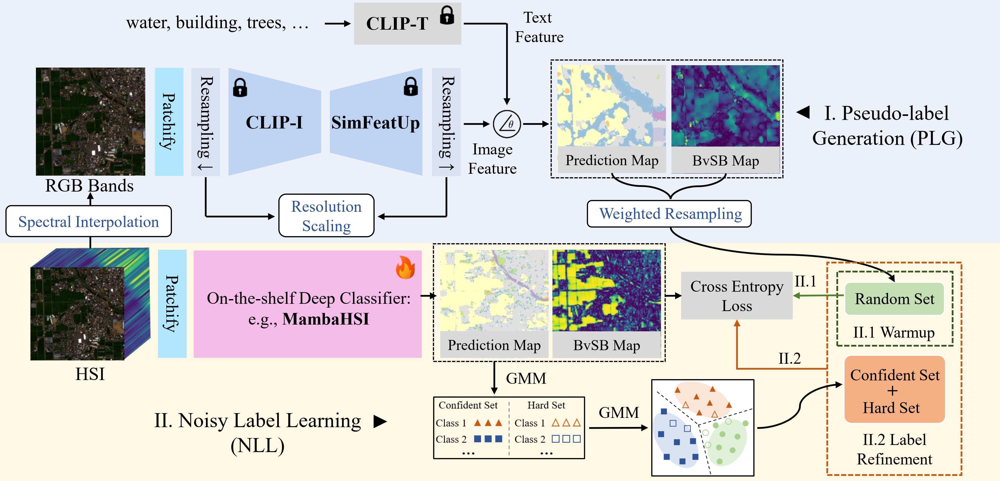

# SPECIAL: Zero-shot Hyperspectral Image Classification With CLIP

---
<!-- <div align="center">
  
</div> -->

*Zero-shot hyperspectral classification framework powered by CLIP*

---

## 🛠️ Code Usage Guide

### 1. Environment Setup
```bash
# Create conda environment
conda create -n special python=3.10 
conda activate special

# Install core dependencies
pip install requirements.txt
```
### 2. Data Preparation
Download the data from [Baidu Netdisk](https://pan.baidu.com/s/1tJjddYeVAVyY0wpHrAckHw?pwd=y15t)(code: y15t) and place it in the data folder. (The Reflectance of AeroRIT needs to be downloaded from [GoogleDrive](https://drive.google.com/drive/folders/1PPXXqZQSXm3QTSAuy8MjL1O_ck5p8TvM?usp=drive_link))

### 3. Download CLIP
Download the CLIP from [Baidu Netdisk](https://pan.baidu.com/s/1iMP45g8yAJ4dIUiDwRVymQ?pwd=vii1)(code: vii1) and place it in the checkpoint folder.

### 4. Run Classification
```
# AeroRIT
python test.py --data_name AeroRIT --epoches 10 --warmup_epoches 5 --eta_min 1e-5

# Pavia Centre
python test.py --data_name PaviaC --epoches 20 --warmup_epoches 10 --eta_min 1e-4
```


## 🙌 Acknowledgements 

This work builds upon [FeatUp](https://github.com/mhamilton723/FeatUp) and [SegEarth-OV](https://github.com/likyoo/SegEarth-OV), and we extend our sincere gratitude to the researchers and developers.


